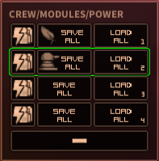

# Shortest Trip To Earth - Preset Highlight



Makes the currently loaded preset easier to see by using a more visible highlight color.
The color can be customized.  See the [Configuration](#configuration) section below.

**Important**: When a game is loaded, there will not be a highlighted preset as the game does not actually load a preset at that point.  Once a preset is loaded, the mod will highlight the current preset.

# Compatibility
* Some mods instruct the user to overwrite the game's original files.  This mod may not be compatible with those mods.
    * This mod does not affect the original game files.
* Safe to add and remove from existing saves.

# Configuration
The configuration file will be created on the first game run and can be found at `<Steam Directory>\steamapps\common\Shortest Trip to Earth\BepInEx\config\HighlightPreset.cfg`.  The changes will take effect the next time the game is run.

|Name|Default|Description|
|--|--|--|
|HighlightColor|00FF00FF (Green)|The highlight color for the current preset.  The Value is in RGBA format|

# Support
If you enjoy my mods and want to buy me a coffee, check out my [Ko-Fi](https://ko-fi.com/nbkredspy71915) page.
Thanks!

# Installation 

This section covers how to install the BepInEx mod loader and the mod itself.

## BepInEx Setup
If BepInEx has already been installed, skip to the [Mod Setup](#mod-setup) section.

* Download BepInEx from https://github.com/BepInEx/BepInEx/releases/download/v5.4.23.2/BepInEx_win_x64_5.4.23.2.zip
* Extract the contents of the BepInEx zip file into the game's directory:
```<Steam Directory>\steamapps\common\Shortest Trip to Earth```
    
    __Important__:  The .zip file *must* be extracted to the root folder of the game.  If BepInEx was extracted correctly, the following directory will exist: ```<Steam Directory>\steamapps\common\Shortest Trip to Earth\BepInEx```.  This is a common install issue.

* Run the game.  Once the main menu is shown, exit the game.  
* If the install was successful, there will now be a ```<Game Dir>/BepInEx/plugins``` directory.

## Mod Setup
* Download the HighlightPreset.zip.  
    * If on Nexumods.com, download from the Files tab.
    * Otherwise, download from https://github.com/NBKRedSpy/STTE-HighlightPreset/releases/
* Extract the contents of the zip file into the ```<Game Dir>/BepInEx/plugins``` folder.
* Run the Game.  The mod will now be enabled.

# Uninstalling

## Uninstalling This Mod Only

This method removes this mod, but keeps the BepInEx mod loader and any other mods.

Delete the directory ```<Steam Directory>\steamapps\common\Shortest Trip to Earth\BepInEx\plugins\HighlightPreset```.

## Uninstall the Mod and BepInEx
This resets the game to an unmodded state by deleting BepInEx and any BepInEx mods.

Delete the following files and folders in the game's directory:
```
BepInEx  (<-- Folder)
.doorstop_version
changelog.txt
doorstop_config.ini
winhttp.dll
```

# Change Log 

## 1.0.0
* Release

# Source Code
Source code is available on GitHub at https://github.com/NBKRedspy/STTE-HighlightPreset
